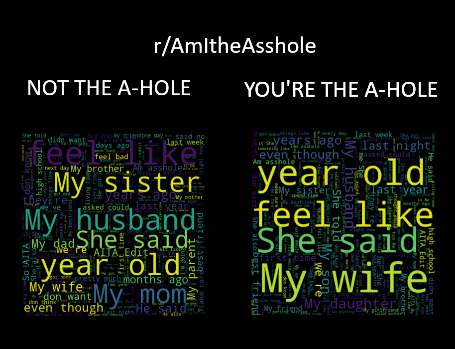
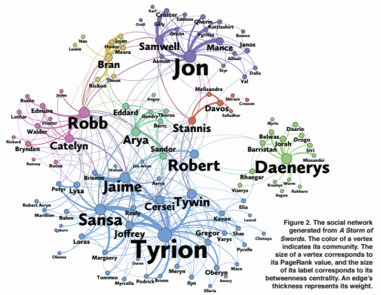
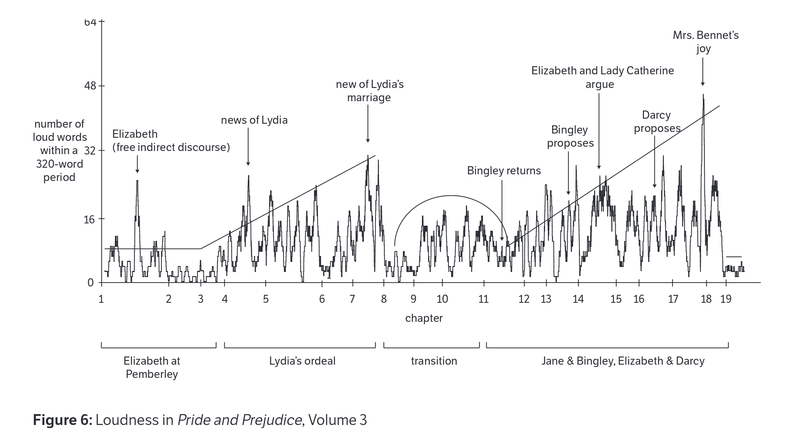
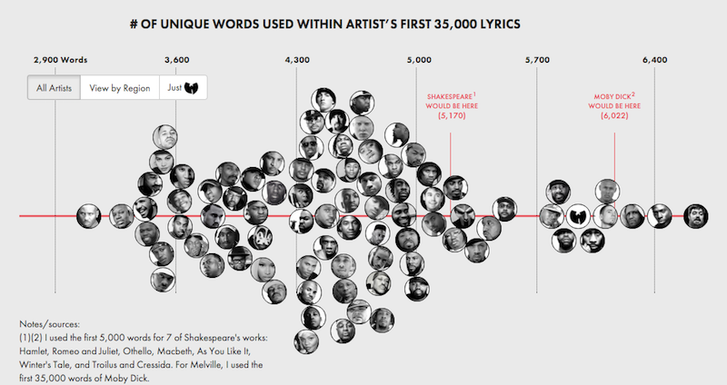
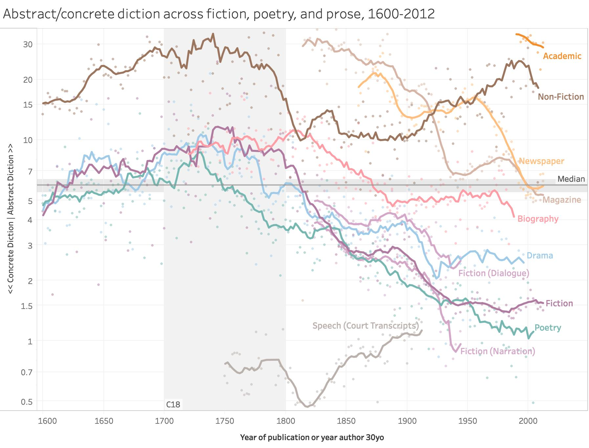

    
# Computing in Context: Computational Linguistics

## Info 

 - Jonathan Reeve (jonathan.reeve@columbia.edu)
 - Department of English and Comparative Literature, Columbia U
 - Linguistic approaches to literature
 - Computational approaches to language analysis

## An Exciting New Field {data-background-video="https://thumbs.gfycat.com/GloriousCautiousGar-mobile.mp4"}

Shares much with: natural language processing, text analysis, cultural analytics, digital humanities, "distant reading"

## No prerequisites

 - No need to speak other languages
 - No need to be a linguistics major
 - Just need an interest in language

# Examples

## AITA? 

## Charting Social Networks

## Comparative linguistics

 - What language(s) are the most similar? 

<video src="images/lexical-distance.mp4" data-autoplay/>

## Loudness

## Rap Lyrics

## Abstract/Concrete

## Computational Authorship detection

 - Who really wrote that Shakespeare play? 

## Language change analysis

 - When did the kids start saying "fire" for things that are good? 

# Let's code

## 

<video src="images/corgi.mp4" data-autoplay/>
